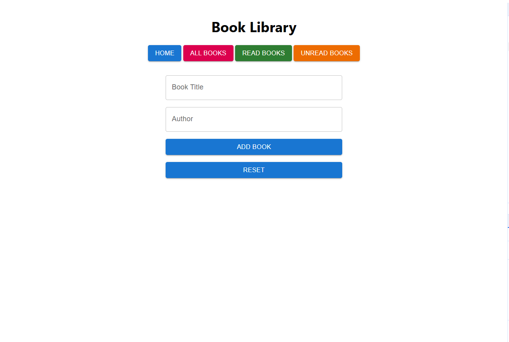

## Book Store

### Overview

A simple Book Library application built using React, Material-UI, Redux, and React Router. Users can add books, view all books, and filter books by read/unread status. The app also supports theme toggling between light and dark modes and shows a toast notification when a book is added.

## Features

- Add books with title and author
- Filter books by read or unread status
- View all books
- Snackbar notification on book addition
- Store book data in Redux state (frontend only)
- Page refresh handling to go to the Home route if the data is lost

The following routes/pages are included in this application:

1. Homepage - This page will contain basic layout along with a form to add new books to the library
2. Description Page - This page will show the details of the chosen article.

### Snapshots

1. Home Page
   

## Tech Stack

- **React**: Frontend framework for building user interfaces.
- **Material-UI**: UI library for React components.
- **Redux**: State management tool to store books and other app data.
- **React Router**: For handling routing between different pages (e.g., Home, All Books).

## Installation

1. Clone the repository:

   ```bash
   git clone https://github.com/your-username/book-store.git
   cd book-store
   ```

2. npm install

3. npm run start

## Project structure

/book-store
├── /public
│ ├── index.html # The HTML page template
├── /src
│ ├── /components # Contains React components like BookForm, AllBooks, etc.
│ ├── /store # Contains Redux actions, reducers, and store
│ ├── /theme # Contains Material UI theme configuration
│ ├── App.js # Main application component
│ ├── index.js # Entry point for React app
├── package.json # NPM package dependencies and scripts
└── README.md # This file
